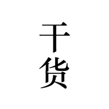

# Gank

<a href="#前言">前言</a> -
<a href="#功能">功能</a> -
<a href="#运行环境">运行环境</a> -
<a href="#版本">版本</a> -
<a href="#贡献">贡献</a> -
<a href="#致谢">致谢</a> -
<a href="#关于我">关于我</a> -
<a href="#开源协议">开源协议</a>

## 前言

非官方版本的干货集中营 iOS App。

## 功能

## 运行环境

- iOS 10.0+
- Xcode 8.0+
- Swift 3.0

## 版本

详情请查看 [版本日志](https://github.com/yeziahehe/Gank/blob/master/RELEASES.md)。

## 贡献

- 感谢你愿意为 Gank 尽到你的一份力，你的创意能够帮助项目变得更好。
- 提交 PR 是参与到项目中最好的方式，我会用最快的速度回复你。
- 如果发现 Bug 或者问题，可以提交 Issue。

## 致谢

- [@代码家](https://github.com/daimajia)
- [干货集中营](http://gank.io/)

## 关于我

- [yeziahehe](https://github.com/yeziahehe)
- [Blog](http://yeziahehe.com/)

## 开源协议
[GNU General Public Licence (GPL)](https://github.com/yeziahehe/Gank/blob/master/LICENSE)
